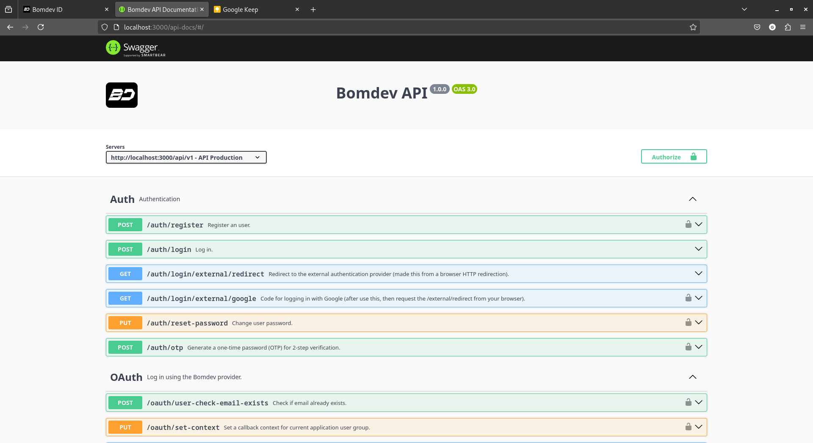
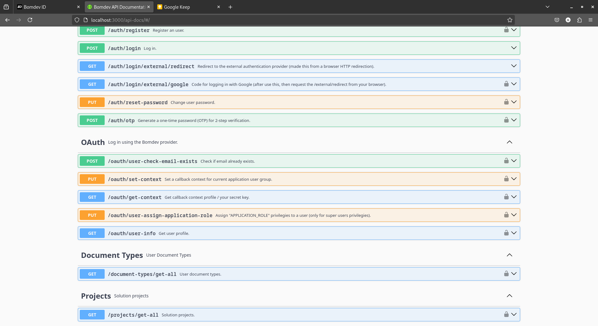

# Node.js Authentication API with Sequelize and MariaDB (Identity Server)

This project is a robust **Authentication API** developed with **Node.js**, utilizing **Sequelize ORM** for **database management** and connecting to a **MariaDB** instance.

The API serves as a centralized **Identity Server**, providing **authentication and authorization** services for multiple client applications and projects. It manages the complete **user lifecycle**, including **registration**, **authentication**, **password recovery**, and **email notifications** for integration purposes.

## Key Features

- Developed with **Node.js** and **Express** framework.
- **Sequelize ORM** for database abstraction and migrations.
- **MariaDB** for data persistence.
- Secure **authentication** using industry-standard practices.
- Centralized **Identity Server** for multiple client projects.
- Full **user management** flow:
  - User registration
  - Login/logout
  - Password reset
  - Email verification
- Integrated **email service** for sending notifications and system-generated messages.
- Modular and scalable codebase for future extensions.
- RESTful API design.

## Technologies Used

- Node.js
- Express.js
- Sequelize ORM
- Procedures
- MariaDB
- Nodemailer (or other email service)
- JWT (JSON Web Tokens) or OAuth2 (if applicable)
- dotenv for environment configuration

